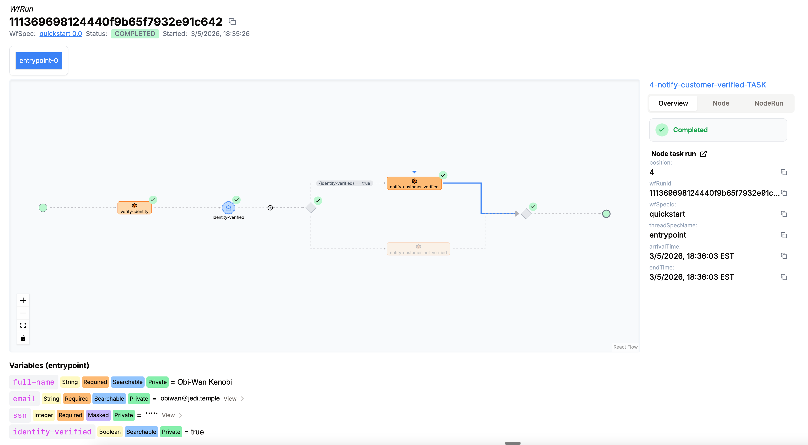
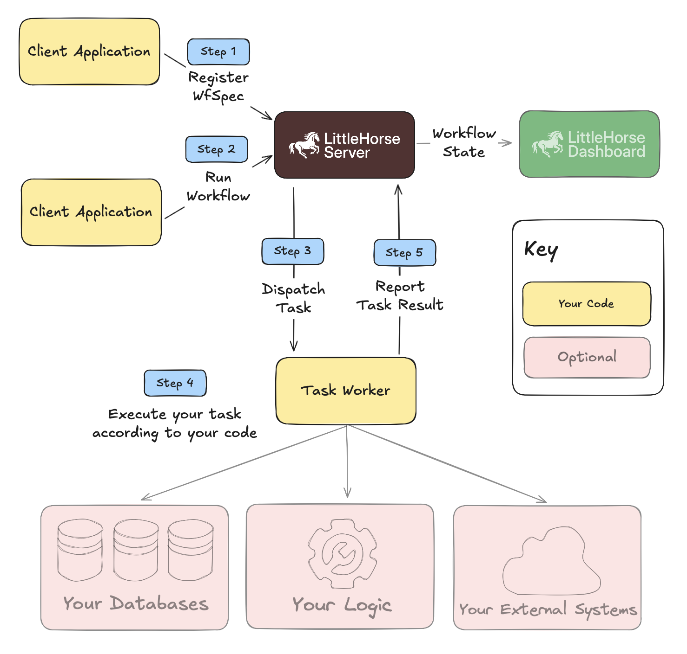

<div align="center">
<a href="https://littlehorse.io/"></a>
<a href="https://littlehorse.io/docs/getting-started/quickstart"></a>
<a href="https://littlehorse.io/docs"></a>
</div>

[LittleHorse](https://littlehorse.io) is the pioneer of the [Business-as-Code](https://littlehorse.io/blog/business-as-code) approach to codifying and orchestrating processes across multiple systems. Built with love by developers, for developers!

Business-as-Code allows software engineers to write code in a language of their choice (Java, Python, Go, C#, Typescript) while operating at a higher level of abstraction: the business process. This increases the importance of software engineers by allowing them to speak the language of business value rather than being preoccuppied with glue code.

LittleHorse maintains an open-source platform for Business-as-Code, based on the [LittleHorse Server](https://github.com/littlehorse-enterprises/littlehorse), which is our distributed & fault-tolerant runtime for Business-as-Code. Our open-source platform is lightweight, easy to deploy, and integrates with programming languages and deployment architectures (eg. Kubernetes, Docker, ECS) that you already have.

LittleHorse Enterprises also provides an enterprise platform for Business-as-Code: the [Saddle Command Center](https://littlehorse.io/products/saddle-command-center), which includes pre-built task workers, connectors, integrations, and low-code GUIs to accelerate Business-as-Code deployments at an enterprise.

## Get Started

### The Essentials

<table>
  <tr>
    <td colspan="3" valign="top">
      <h3>📖 <a href="https://littlehorse.io/docs/getting-started/quickstart">Quickstarts</a></h3>
      <p><strong>Recommended starting point.</strong> Quickstarts are available for all components of the LittleHorse platform.</p>
    </td>
  </tr>
  <tr>
    <td width="33%" valign="top">
      <h3> <a href="https://github.com/littlehorse-enterprises/lh-developer-hub">lh-developer-hub</a></h3>
      <p>Examples, agent skills, and quickstarts. Everything you need to become a Business-as-Code expert.</p>
      <p><strong>This is probably the only repository you need to use LittleHorse well.</strong></p>
    </td>
    <td width="33%" valign="top">
      <h3>📖 <a href="https://littlehorse.io/docs">Documentation</a></h3>
      <p>Documentation is available on our website.</p>
    </td>
    <td width="33%" valign="top">
      <h3>💬 <a href="https://launchpass.com/littlehorsecommunity/free">Slack Community</a></h3>
      <p>Join the LittleHorse community on Slack. Ask questions, share ideas, and meet other users.</p>
    </td>
  </tr>
</table>

We recommend you start with the quickstart, which introduces you to the concept of Business-as-Code. You can explore from there!

### Our Open Platform

The following repositories contain the most important components of our open-source platform (and they are also crucial components of our _Saddle Command Center_ product).

<table>
  <tr>
    <td colspan="3" valign="top">
      <h3> <a href="https://github.com/littlehorse-enterprises/littlehorse">littlehorse</a></h3>
      <p><strong>The core of our open platform.</strong> Contains the code for the LittleHorse Server and our Business-as-Code platform.</p>
    </td>
  </tr>
  <tr>
    <td width="33%" valign="top">
      <h3> <a href="https://github.com/littlehorse-enterprises/lh-agent-connector">lh-agent-connector</a></h3>
      <p>A pre-built Task Worker that uses LangChain to implement the Decision Worker Pattern.</p>
    </td>
    <td width="33%" valign="top">
      <h3> <a href="https://github.com/littlehorse-enterprises/lh-quarkus">lh-quarkus</a></h3>
      <p>Quarkus extensions that make it really easy to write LittleHorse applications in Java.</p>
    </td>
    <td width="33%" valign="top">
      <h3> <a href="https://github.com/littlehorse-enterprises/lh-kafka-connect">lh-kafka-connect</a></h3>
      <p>Connectors for Apache Kafka Connect to start <code>WfRun</code>s and post <code>ExternalEvent</code>s in the LittleHorse Server.</p>
    </td>
  </tr>
  <tr>
    <td width="33%" valign="top">
      <h3> <a href="https://github.com/littlehorse-enterprises/lh-user-tasks-bridge">lh-user-tasks-bridge</a></h3>
      <p>Connects your OIDC provider to the LittleHorse Server's User Tasks capability, mapping user identities to assigned tasks.</p>
    </td>
    <td width="33%"></td>
    <td width="33%"></td>
  </tr>
</table>

## What is Business-as-Code?

**Business-as-Code** is the practice of using code to define and orchestrate processes across multiple systems and people. Software engineers use Business-as-Code to orchestrate flows involving external SaaS APIs, microservices, event queues, agents, and human steps.

Business-as-Code explicitly specifies process logic at the business level from the top-down rather than letting processes emerge bottom-up via brittle point-to-point connections between systems. This approach is useful both for high-speed microservice flows, IoT integration, agent orchestration, and back-office automation alike.



:point_up: This picture shows a running instance (`WfRun`) for the process (`WfSpec`) defined by this code :point_down:

```java
public void quickstartWf(WorkflowThread wf) {
    WfRunVariable fullName = wf.declareStr("full-name").searchable().required();
    WfRunVariable email = wf.declareStr("email").searchable().required();

    // Social Security Numbers are sensitive, so we mask the variable with `.masked()`.
    WfRunVariable ssn = wf.declareInt("ssn").masked().required();

    WfRunVariable identityVerified = wf.declareBool("identity-verified").searchable();

    wf.execute(VERIFY_IDENTITY_TASK, fullName, email, ssn).withRetries(3);

    NodeOutput identityVerificationResult = wf.waitForEvent(IDENTITY_VERIFIED_EVENT)
            .timeout(60 * 5) // 5 minute timeout
            .withCorrelationId(email)
            .registeredAs(Boolean.class);

    wf.handleError(identityVerificationResult, LHErrorType.TIMEOUT, handler -> {
        handler.execute(NOTIFY_CUSTOMER_NOT_VERIFIED_TASK, fullName, email);
        handler.fail("customer-not-verified", "Unable to verify customer identity in time.");
    });

    identityVerified.assign(identityVerificationResult);

    wf.doIf(identityVerified.isEqualTo(true), ifBody -> {
        ifBody.execute(NOTIFY_CUSTOMER_VERIFIED_TASK, fullName, email);
    })
    .doElse(elseBody -> {
        elseBody.execute(NOTIFY_CUSTOMER_NOT_VERIFIED_TASK, fullName, email);
    });
}
```

As you can see, the code above closely mirrors our example KYC business process. LittleHorse handles retries, timeouts, and orchestration across services for you, allowing your `WfSpec` to focus just on what matters to the business. Task workers handle integrations with external systems and databases.

The process of running workflows in LittleHorse is simple:

- Define tasks which are units of work that can be used in a process, and implement programs that execute those tasks.
- Define your workflows and tell the workflow engine about it
- Run the workflow
- The workflow engine ensures that your process gets executed correctly.

<p align="center">

</p>

## FAQ

### How is Business-as-Code different from Infrastructure-as-Code?

Infrastructure-as-Code brings governance, observability, version-control, and automation to devops, which is the process of provisioning infrastructure and deploying applications. Business-as-Code provides the same exact benefits (!!) but in a different space: business process orchestration.

### How is Business-as-Code different from Durable Execution like Restate, DBOS, or Temporal?

Business-as-Code operates at a higher level of abstraction than Durable Execution. In Durable Execution, side effects of your functions & method calls (including remote task executions on different workers) are recorded by the Durable Execution engine. In case your function fails, it can be retried, and side effects are replayed.

In contrast, in Business-as-Code, LittleHorse understands your business process. You first write code that specifies the process, which is then compiled into a computational graph (a `WfSpec`) that LittleHorse understands. There's no function that gets replayed, because the orchestration is handled by the LittleHorse Server. This enables several key features:
* Visualization of your process graph.
* Sending real-time events into Apache Kafka as your workflow executes.
* Easier 

Our founder, Colt McNealy, wrote a detailed blog comparing Business-as-Code and durable execution. Read it [on our website](https://littlehorse.io/blog/beyond-durable-execution).

### Does LittleHorse fit in with Kafka?

LittleHorse is tightly integrated with the Apache Kafka ecosystem. The LittleHorse Server uses Kafka (or any Kafka-compatible system) as its internal durable commit log. If you already have a Kafka service, then deploying LittleHorse is easy!

We also have a two-way integration with Kafka:

1. The LittleHorse Server produces events to Kafka in real-time as your workflow progresses, allowing you to turn workflows into business insights.
2. Our [Kafka Connectors](https://github.com/littlehorse-enterprises/lh-kafka-connect) allow you to trigger workflows and post events to LittleHorse from Kafka topics.

Kafka is great for event streaming and messaging, but it's not the best solution for reliably executing multi-step flows across multiple services: sometimes, it's hard to manage business processes when the logic is scattered across different consumers. That's what Business-as-Code fixes!

### Do I need Business-as-Code if I don't read the code anymore?

In many cases, it's faster to not read the code that Claude writes! Business-as-Code actually makes it safer to do that. When Claude writes a `WfSpec`, the LittleHorse dashboard _deterministically_ visualizes the exact business logic written in that `WfSpec`. You can easily (visually) verify the way all of your sub-systems are composed together into a workflow rater than having to chase down the connection logic through opaque code and queue consumers.

### How does Business-as-Code help me orchestrate agents?

Using agents to write code is one thing, but putting them into user-facing workloads is more difficult because there is no live verification step. Doing this requires properly connecting the agent into workflows, auditing what the agent does, and preventing the model from doing the "wrong thing". Business-as-Code helps you create these guardrails:

* Invoke the Agent as a Task as part of a larger workflow
* Codify the deterministic parts of the workflow that happen before and after the fuzzy logic which is done by the agent
* Audit every tool call as a Checkpoint in a TaskRun

Our founder, Colt McNealy, wrote a blog about how companies use LittleHorse to deploy agents in this way: [Decision Workers](https://littlehorse.io/blog/decision-workers).

You might also want to check out our open-source [Agent Worker](https://github.com/littlehorse-enterprises/lh-agent-connector), which was purpose built for these workflows.

### How does Business-as-Code help manage the mountain of new code built by agents?

Coding agents have _massively_ sped up the creation of new code.  More and more business processes will be automated, which means more and more integrations and microservices will be deployed. This poses two problems:

1. It's harder to understand all of the new code when we don't write it ourselves.
2. With more and more integrations, it's harder and harder (for both humans and agents) to write processes across

Business-as-Code solves these two problems by **visualizing the end-to-end process** in the LittleHorse Dashboard, and also **handling the orchestration across all of our systems.**

Business-as-Code also helps software engineers move up the stack and become more valuable to their business. The future is uncertain, but we engineers solve problems and we adapt! Business-as-Code is one way that we can get ready for the next wave of software development.

### Is LittleHorse fast? Does it scale?

LittleHorse is fast: depending on the configuration of the LittleHorse Server, latency between two steps in a workflow is between 10-40ms.

It also scales horizontally: some of our users run 1,000+ tasks per second in parallel on a three-node cluster. LittleHorse can scale horizontally much further than that.

It is also fault-tolerant and can be configured to have standby replicas, providing high availability in the face of server crashes.

### How do I deploy LittleHorse?

The LittleHorse Server is the core of the platform. Several of our users deploy only the LittleHorse Server and do not need the other components. It is a JVM application and has only Apache Kafka as a dependency. For examples on how to deploy it, check out the [docker-compose examples](https://github.com/littlehorse-enterprises/littlehorse/tree/master/examples/docker-compose) on GitHub.

Your Task Workers need to connect to LittleHorse. They can run _anywhere_ so long as they can open a connection to the LittleHorse Server. Some of our users even have workflows that span Task Workers deployed in different continents for data residency compliance.

If you wish to use our commercial product, the Saddle Command Center is available as a multi-tenant SaaS, a dedicated SaaS, as a BYOC service, or delivered on-prem via a Kubernetes Operator.

### If LittleHorse is Open-Source, how do you make money?

LittleHorse Enterprises provides several products:

1. The [Saddle Command Center](https://littlehorse.io/products/saddle-command-center), which is an enterprise Business-as-Code platform built on top of our open-source. It contains connectors, integrations, and pre-built task workers to speed enterprise development. It is available as a serverless SaaS, dedicated SaaS, or on-premise product.
2. Our [Business-as-Code Practice](https://littlehorse.io/products/business-as-code-practice) is a white-glove service in which our forward-deployed engineers implement Business-as-Code to solve automation, integration, or architecture challenges for our customers.
3. We also provide support for the open-source LittleHorse components and can run them as SaaS services.

These products fund the development of our open-source platform, which is our true passion.

<p align="center">
  
</p>
